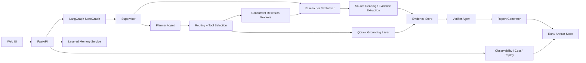

# Architecture

## Goal

Build an AI research copilot that can supervise a run, plan, search, retrieve contextual evidence, recall memory, verify claims, evaluate RAG quality, and report with citations.

The product is best described as **AI Research Copilot for complex questions**.
The technical layer uses LangGraph + Agentic RAG: it avoids a plain
`question -> top-k chunks -> answer` pipeline by making planning, tool selection,
query rewrite, evidence sufficiency, citation checks, and revision explicit
runtime states.

One-line product statement:

> AI Research Copilot for complex questions: planning, search, reading,
> retrieval augmentation, memory recall, citation verification, and evaluation
> replay produce traceable research reports.

The main product path is **planning -> search/reading -> synthesis ->
verification/evaluation -> replay**. RAG is a grounding and memory layer for
contextual documents, already-read source excerpts, and prior run recall; it is
not the only retrieval path and should not be described as the whole system.

## System Flow

## Core Modules

### Product Surfaces

- Portal: submit research questions, inspect the generated plan, routes, report, and citations.
- Admin: inspect sources, memory, telemetry, checkpoints, and runtime config.
- The first UI is a dependency-light static research workspace served by FastAPI so the AI core remains the center of the project.
- The workspace surfaces provider readiness, job progress, report review, route inspection, memory governance, and trace timeline without adding a heavy frontend build step.
- A heavier frontend can be added later when streaming jobs, authentication, collaborative editing, or richer report review becomes necessary.

### Orchestration Runtime

- The default runtime is a LangGraph `StateGraph`, matching the graph-first direction used by Open Deep Research.
- The graph nodes are `supervisor_start`, `memory_recall`, `planner`, `research_supervisor`, `parallel_research`, `reporter`, `verifier_evaluator`, `revision_prepare`, `memory_write`, and `finalize`.
- `research_supervisor` follows the ODR tool-loop boundary: it records `think_tool`, delegates concrete research units with `ConductResearch`, and carries `ResearchComplete` criteria into the trace/checkpoint artifacts.
- The graph compiles with a single-node LangGraph SQLite checkpointer by default; it falls back to in-process `MemorySaver` only when strict provider mode is disabled.
- The older custom workflow remains available through `ARC_ORCHESTRATION_RUNTIME=custom` for comparison and offline fallback.
- `ARC_STRICT_PROVIDERS=true` turns the local app into a real-provider demo: missing model/search/embedding/rerank/Qdrant/checkpointer configuration fails startup instead of silently downgrading.
- This repo does not import Open Deep Research as a runtime dependency; it uses ODR as the primary learning/reference target and adapts the same graph-shaped design pattern with product-specific nodes and schemas.

### Job Manager

- Accepts research jobs separately from final run artifacts.
- Tracks `queued`, `running`, `completed`, `failed`, and `cancelled` states.
- Executes offline/test research jobs through a single-worker background queue.
- Submits strict local demo jobs to Celery over Redis for a single-node API/worker split.
- If `ARC_JOB_QUEUE_BACKEND=celery` is used in strict provider mode, enqueue failures fail the job instead of falling back to the in-process worker.
- Celery mode requires `ARC_QDRANT_URL`; embedded Qdrant paths are single-process only and are not used for API/worker separation.
- Persists job and run records in SQLite and refreshes status reads from SQLite, so a local API process can observe updates written by a separate worker process.
- Records attempts, retry errors, cancellation requests, and timeout metadata.
- Records handoffs, trace events, and failure states so a run can be inspected after completion.
- This is intentionally not described as a production distributed scheduler; Celery/Redis is optional process separation for personal deployment, while multi-worker production scheduling remains out of scope.

### Planner Agent

- Normalizes the user request.
- Breaks it into sub-questions.
- Decides whether clarification is needed.
- Emits a schema-backed planning contract.
- In strict real-provider mode, the plan is generated by the configured chat model through a structured contract. Offline tests can still use deterministic planning.

### Research Agents

- Run plan-item research concurrently with a configurable worker budget.
- Execute the `ConductResearch` calls selected by the research supervisor; offline deterministic providers only fill the same schema for test/fallback runs.
- Use a pluggable search registry inspired by Open Deep Research: Tavily, Exa, Perplexity, arXiv, PubMed, Linkup, OpenAI native web search, Anthropic native web search, plus DuckDuckGo, Brave, and SerpAPI adapters.
- For Tavily, request provider `raw_content` when enabled and pass it through the source reader before report synthesis.
- The v1 source reader has three strategies: `extract` for deterministic query-relevant snippets, `model_compress` for an Open Deep Research-style structured `summary/key_excerpts/relevance/limitations` contract, and `chunk_rerank_compress` for Open Deep Research legacy-style split/rerank plus neighbor-window expansion before compression.
- This external web path matches the practical v1 boundary of the inspected Open Deep Research reference: provider search returns `raw_content`, the researcher compresses it, and final synthesis keeps citations attached to source URLs. It is not presented as a full browser automation stack.
- Summarize evidence with citations.
- Return structured findings instead of raw text only.

### External vs Internal Evidence

- External search is used for fresh web evidence, papers, and public references.
- Internal grounding is used for uploaded documents, project notes, and prior runs.
- A corpus profile summarizes what uploaded/project sources exist so the research supervisor can decide whether internal grounding is actually available.
- The research supervisor can route a task to one or both sources through `ConductResearch` arguments.
- Each delegated route records selected tools, rewritten web/internal queries, minimum evidence thresholds, minimum source diversity, and sufficiency criteria.
- Deterministic route hints are kept as offline/test scaffolding and as defensive fallback inputs. They are not the primary real-provider decision layer.
- The verifier compares the evidence channels instead of assuming they say the same thing.
- The reporter keeps source attribution separate so the final answer stays traceable.
- Qdrant backs the internal embedding index, while the route contract stays stable.

### Grounding Layer

- Ingests local text, Markdown, HTML, and optional PyMuPDF-backed PDF files through a reader boundary before indexing.
- Splits Markdown and HTML by headings into section segments with `section_heading`,
  `section_level`, `section_path`, and section ordering metadata before chunking.
- Splits PDFs into page segments with `page_number`, `page_count`, block count,
  heading hints, table hints, page dimensions, and rotation metadata before
  chunking so provenance and layout signals can survive retrieval.
- Performs paragraph-aware child chunking with overlap, indexing-time contextual retrieval prefixing, LightRAG-inspired entity/relation graph indexing, Qdrant dense retrieval, SQLite FTS5/BM25 keyword retrieval, RRF/DBSF fusion, reranking, and parent/neighbor context expansion.
- Preserves source attribution so each report section can be traced back.
- Works as the internal evidence channel, distinct from web search.

Parsing and chunking are intentionally separated. The local `DocumentReader`
normalizes file content and emits document, section, or page segments with
metadata. For PDFs, it prefers PyMuPDF block extraction to preserve reading order,
falls back to plain page text when block extraction is unavailable, records
layout metadata, and appends compact Markdown-like table text when PyMuPDF
`find_tables()` can extract rows. The `DocumentStore` then builds child chunks
that include title, source, chunk position, URL, selected scalar metadata, and a
chunk-specific contextual retrieval prefix before embedding and BM25 indexing.
The prefix is generated at ingestion time, cached by document/chunk hash and
prompt version, and stored in evidence metadata as `context_prefix` so retrieval
behavior is inspectable. Search retrieves precise child chunks, fuses a
lightweight entity/relation graph signal into the candidate set, then returns a
same-document parent context window around the matched child so report synthesis
gets enough surrounding context. This avoids hiding parser decisions inside
vector search and makes it clear which stage should be improved when retrieval
quality is weak. The external web reader follows the same engineering principle:
`chunk_rerank_compress` first retrieves child chunks for precision, then expands
the selected chunks with a small neighbor window so report synthesis sees the
premise, number, and conclusion even when provider `raw_content` crosses a chunk
boundary.

### Why RAG fits this project

- The product is evidence-driven, not a free-form creative generator.
- Answers should be grounded in uploaded documents, prior runs, memory, and web evidence.
- Retrieval is used as a grounding layer for the planner, researcher, and reporter.
- Memory stores preferences and distilled conclusions; retrieval brings back supporting evidence.
- Fine-tuning is a poor fit because the source set changes and provenance matters.
- Plain keyword RAG is too weak here, so the repo uses contextual retrieval prefixing, parent-child retrieval, LightRAG-inspired graph augmentation, Qdrant dense vectors, a real SQLite FTS5/BM25 keyword index, fusion, and reranking first.
- Agentic RAG adds query rewrite, tool selection, multi-query retrieval, sufficiency scoring, and revision-triggering quality gates.
- Full GraphRAG, RAPTOR, or LLM-heavy knowledge graph construction remain out of scope for v1. The implemented graph layer is a lightweight entity co-occurrence and neighbor-expansion signal inspired by LightRAG, designed to improve cross-chunk recall without changing the ODR-style research workflow.
- For larger corpora, the same contract can be swapped to pgvector or another hybrid retrieval backend without changing the orchestration flow.
- The hybrid implementation uses Anthropic-style contextual retrieval prefixes, Qdrant dense vector search, and SQLite FTS5 `bm25()` keyword search, then fuses results with `RRF` or `DBSF` before applying a pluggable reranker.
- It intentionally does not run Elasticsearch/OpenSearch in v1. The project is a single-node research copilot, so SQLite FTS5 gives a real BM25 lexical signal without adding dual-write consistency, analyzer configuration, or search-cluster operations. Elasticsearch remains a future scale-out option if the corpus grows or fielded search/highlighting becomes a product requirement.
- The default reranker calls Qwen/DashScope `qwen3-rerank` when an API key is configured. Deterministic `rule_diversity_chunk_bonus` is reserved for offline runs and tests, and is disabled by `ARC_STRICT_PROVIDERS=true`.
- For DashScope, the reranker accepts the generic `https://dashscope.aliyuncs.com/compatible-mode/v1` base URL and maps it to the rerank service endpoint internally, because the generic compatible-mode endpoint does not expose `/reranks` directly.

### Memory Service

- Stores session notes, canonical facts, and topic summaries.
- Supports short-term context and long-term memory.
- Uses explicit write and recall rules instead of a flat key/value store.
- Ranks memory recall with lexical matching, embedding-assisted semantic similarity, confidence, memory layer, and governance status.
- Adds governance metadata to canonical memory: conflicts are retained, marked `needs_review`, and exposed through a governance report instead of being overwritten silently.
- This follows the useful subset of PraisonAI's memory direction without turning the project into a generic memory platform. PraisonAI also exposes broader short/long/entity/user memory, quality-aware search, session stores, and knowledge retrieval; this repo keeps only the product-specific pieces needed for deep research.

### Model Provider

- Exposes an OpenAI-compatible chat and embeddings adapter.
- Uses deterministic test doubles by default for CI and offline development.
- Allows chat-only providers to use deterministic local embeddings in offline mode, or a separate OpenAI-compatible embedding endpoint for strict real-provider demos.
- Keeps planner, verifier, and reporter outputs schema-backed.

### Verifier Agent

- Checks citation completeness.
- Detects contradictions or missing evidence.
- Flags weak claims before final report generation.

### Report Generator

- Writes the final answer or report.
- Keeps source references attached to each section.
- Follows the Open Deep Research final-report pattern: compressed findings are
  synthesized by the report model, while `citation_indexes` are mapped back to
  existing evidence so the model cannot invent source objects.

### Observability Layer

- Tracks token usage, tool calls, handoffs, and latency.
- Stores traces, failures, and replay inputs.
- Helps explain why a run succeeded or failed.
- Persists run-level checkpoints in SQLite and supports a single-node LangGraph SQLite checkpointer for graph execution. Full distributed resume remains out of scope; the README/API calls the current behavior single-node checkpointing plus durable trace/replay.
- Exposes `GET /v1/runtime/provider-check` so demos can verify real-provider readiness without exposing secret values.

### RAG Evaluation Layer

- Scores plan coverage, retrieval hit rate, contextual retrieval contribution, evidence sufficiency, tool-selection coverage, query-rewrite count, source quality, context precision, context recall, faithfulness proxy, citation precision, citation source coverage, source diversity, and unsupported sections.
- Emits an `evaluation` trace event and a `rag.evaluated` checkpoint for each run.
- Feeds weak citation or retrieval quality back into the supervisor revision loop.
- The inspected Open Deep Research reference keeps source quality as an evaluator concern rather than a separate runtime source-filtering policy. This repo follows that choice and does not add a standalone source quality policy layer for v1.
- `scripts/run_llm_judge_eval.py` provides an optional Open Deep Research-style
  LLM-as-judge artifact for demo reports, scoring research depth, source quality,
  analytical rigor, structure, groundedness, and completeness.
- `scripts/run_ragas_eval.py` provides an optional Ragas artifact over saved demo
  evidence when the `.[eval]` extra is installed.
- Runtime RAG metrics remain lightweight local proxies. They are designed to make retrieval and citation failure modes visible without adding benchmark cost to every request.
- Demo artifacts should be regenerated before important interviews. Search providers can return mixed blogs, videos, or tutorial sources; source quality is meant to be visible in evaluation instead of silently hidden by a runtime filter.

## Interfaces

- `POST /v1/research/jobs`: submit an asynchronous research job and receive a job envelope.
- `GET /v1/research/jobs`: inspect submitted jobs.
- `GET /v1/research/jobs/{job_id}/status`: inspect queued/running/completed/failed/cancelled state.
- `GET /v1/research/jobs/{job_id}/result`: fetch the completed run artifact.
- `POST /v1/research/jobs/{job_id}/cancel`: request cancellation for queued/running jobs.
- `POST /v1/research/runs`: synchronous run endpoint for tests and simple clients.
- `GET /v1/research/runs/{run_id}/status`: inspect completed run timing and source count.
- `GET /v1/research/runs/{run_id}/result`: inspect report, issues, evidence, routes, and checkpoints.
- `GET /v1/research/runs/{run_id}/evaluation`: inspect RAG and citation quality gates.
- `GET /v1/research/runs/{run_id}/trace`: inspect the handoff and tool trace for a run.
- `DELETE /v1/research/history`: clear run/job/telemetry history, with optional `include_memory=true`.
- `GET /v1/documents`: list indexed grounding documents.
- `POST /v1/documents`: add a grounding document.
- `POST /v1/documents/ingest`: parse a local file into one or more grounding documents.
- `DELETE /v1/documents/{document_id}`: remove one document and its vector chunks.
- `DELETE /v1/documents`: clear the document corpus and retrieval index.
- `GET /v1/memory?layer=&topic=&run_id=&session_id=&tag=`: filter memory records.
- `GET /v1/memory/governance`: inspect canonical memory conflicts and review-required records.
- `GET /v1/runtime/config`: inspect agents, tools, routing, storage, and quality gates.

## Data Model

- `research_session`
- `research_job`
- `research_task`
- `evidence_item`
- `memory_item`
- `report_version`
- `run_trace`
- `run_ledger`

## Inspiration Split

- `open_deep_research` primary: LangGraph StateGraph orchestration, supervisor/researcher split, planning, parallel research, source compression, citations, report generation, and judge-style evaluation
- `PraisonAI` secondary: memory, reader registry, handoff, observability, evaluation, workflow patterns

## MVP Sequence

1. Search-only report generation.
2. Add contextual document grounding.
3. Add memory and user preferences.
4. Add verification and replay.
5. Add evaluation and scoring.
6. Wire real search and model providers for demo runs.
7. Harden the LangGraph runtime with richer interruption/resume and streaming trace support.
