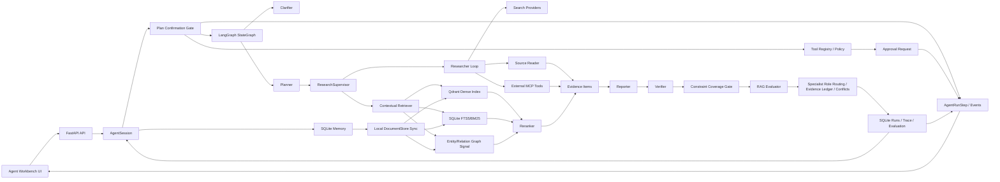

# Architecture

## Goal

AI Research Copilot is implemented as a single-node **Conversational Research Agent Runtime with HITL, tool policy, memory evaluation, and constraint coverage**. It accepts a chat session, remembers user/team constraints, drafts a research plan for confirmation, then gathers evidence through web search, GitHub MCP, and local contextual retrieval to produce a citation-backed report with trace and evaluation artifacts.

The repo should be treated as an AI engineering experiment and interview project, not as a claim that a small student-built assistant can outperform Codex or Deep Research. The useful learning target is the runtime mechanism: stateful sessions, memory, interactive planning, structured tool calls, bounded researcher loops, tool policy, human approval, evidence contracts, Agentic RAG, constraint coverage, verification, evaluation, and replay.

The runtime is aimed at open-source project research, engineering decision research, and local technical-corpus grounding. It is not a private-data assistant, a GitHub-only analyzer, or an MCP wrapper around another deep-research system.

The current runtime path is:

```text
chat session -> memory -> clarify/plan -> confirm -> step stream -> tool policy/approval -> supervise -> search/read/retrieve -> synthesize -> constraint gate -> verify/evaluate -> specialist routing/evidence ledger -> frozen replay
```

The agent layer is deliberately thin. It owns `AgentSession`, `AgentMessage`, `AgentPlanDraft`, `AgentRunStep`, memory extraction, memory lookup, tool policy, approval artifacts, and the confirmation gate. It does not replace `ResearchCopilot`; it converts a confirmed plan into the existing `ResearchRequest` and binds the resulting job/run back to the session.

## System Flow



## Agent Session Layer

The conversational layer provides the product-facing loop:

```text
POST /v1/agent/sessions
-> POST /messages
-> memory extraction
-> relevant memory injection
-> clarification or plan draft
-> user confirms
-> step/tool/approval artifacts are written
-> ResearchCopilot.submit_job
-> completed run is attached back to the session
```

Important schema objects:

- `AgentSession`: durable conversation container with status `collecting | planning | awaiting_confirmation | researching | completed | failed`.
- `AgentMessage`: user, assistant, system, or tool message with an intent such as `clarify`, `plan`, `confirm`, or `research`.
- `AgentPlanDraft`: readable research brief, plan items, assumptions, success criteria, and `required_confirmation=true`.
- `AgentRunStep`: session-visible stage record for message, planning, approval, tool call, retrieval, research, report, verification, evaluation, and failure.
- `AgentSessionBundle`: session, messages, plan draft, relevant memory, steps, tool registry, tool invocations, approval requests, active job, active run, constraint coverage, memory evaluation, role assignments, route decisions, evidence ledger, benchmark summary, and MCP status.

The most important design choice is the confirmation gate. A good agent should not turn every chat turn into a long-running research job. The session first collects constraints, asks one clarification question if needed, or drafts a plan. Only `POST /v1/agent/sessions/{session_id}/confirm-plan` starts the research job.

## Node, Agent, And Specialist Lane Boundary

The project uses three different layers and deliberately does not execute them twice:

- A **workflow node** is a control-flow position in `LangGraphResearchRuntime`. It reads and writes `ResearchGraphState`, records checkpoints, and decides which stage runs next.
- An **agent** is a model-backed capability called by a node. `PlannerAgent` creates the plan, `SupervisorAgent` delegates research units, `ResearchAgent` runs the bounded tool loop, `ReporterAgent` synthesizes the report, and `VerifierAgent` checks quality.
- A **specialist lane** is a responsibility label attached to plan items and evidence. `RepoSignalLane`, `ArchitectureFitLane`, and `OpsRiskLane` are selected before the run and recorded after the run for route/evidence evaluation. They do not make a second model call or start another tool loop.

The important execution rule is:

```text
node -> agent capability -> shared state/evidence -> next node
```

The specialist routing module is an explanation and evaluation boundary, not a hidden second workflow. Its exported `execution_mode` is `role_routing_overlay`, and `online_worker` is `false`.

## Workspace And Skills

The session layer now has two extra control-plane concepts:

- `WorkspaceProfile`: the explicit team context carrier. It holds the intended team, stack, deployment constraints, risk policy, preferred sources, and disabled tools for a workspace. New sessions bind to a workspace, so the user does not have to paste the same context on every turn.
- `ResearchSkill`: a small playbook catalog. It does not try to become a plugin marketplace. Instead, it gives the agent a stable scenario label, a set of required inputs, and a planning/evaluation shape for the three main demos.
- `session_key`: a stable external handle mirrored from the session id. It exists so export bundles and event timelines can be discussed separately from the internal persistence detail.
- `context_compaction`: once a session becomes long, the agent stores a compact summary in `AgentSession.context_summary` and reuses it in later planning.
- `heartbeat`: while a confirmed run is still active, the session writes a lightweight heartbeat step so the UI and export bundle can show that the agent is alive.
- `export bundle`: the session export endpoint packages the workspace, messages, plan, steps, events, memory, tool invocations, approvals, report, trace, evaluation, and constraint coverage into one replayable JSON object.

## Memory Layer

Memory is built into SQLite and borrows the Mem0-style layering without introducing the Mem0 SDK.

Scopes:

- `user_memory`: long-lived user preferences, for example "I want this project to help with autumn recruiting."
- `project_memory`: team/project constraints, for example "Python/FastAPI, single-machine Docker Compose, rollback required."
- `session_memory`: current conversation facts, plan state, temporary goals, and follow-up constraints.

Kinds:

- `preference`
- `constraint`
- `decision`
- `fact`
- `todo`

Each user message is scanned by a lightweight extractor. Explicit preferences, team constraints, and concrete session facts become `MemoryItem` rows. v2 also stores `MemoryExtractionResult` so candidates, accepted memories, rejected duplicates, and extractor reasons can be inspected. Project-scope memory is inserted into the local document store with `kind=agent_memory`, so the existing vector/BM25/graph retrieval layer can retrieve it during research. This makes team constraints part of the local knowledge base instead of repeated prompt text.

Project-scope memory and `kind=constraint` memory are treated as hard constraints. Confirmed plans inject them into `ResearchRequest.topic` as `[project/constraint]` lines, and completed runs are checked by the constraint coverage gate.

## Agent Steps, Tool Policy, And Approval

v2 adds a session-visible observability layer inspired by LangGraph streaming/HITL, OpenAI Agents tracing, OpenHands event logs, and CrewAI observability.

New schema objects:

- `AgentRunStep`: a durable stage record with `kind`, `status`, `actor`, `tool_name`, previews, evidence count, and metadata.
- `AgentToolDefinition`: the tool registry entry with channel, schema, auth status, risk level, and failure mode.
- `ToolInvocation`: a concrete tool call or policy-gated action.
- `ApprovalRequest`: a human confirmation artifact for risky or unavailable actions.
- `ConstraintCoverage`: a quality check showing whether hard constraints are covered by report sections or evidence.

The v2 approval model is intentionally conservative. It records approval requests for unavailable or risky MCP actions, especially missing GitHub MCP auth, but it does not interrupt every low-risk web/vector call. True durable interrupt/resume is a v3 direction.

Default tool policy:

- `web_search`: low risk, no approval.
- `vector_retrieval`: low risk, no approval.
- `mcp_tool`: medium risk, enabled only when configured and authenticated. If configured but unavailable, the UI shows `GitHub MCP not configured`, writes a pending approval, and does not count fake MCP evidence.

## Specialist Routing Harness

v4 adds a narrow specialist routing harness for the open-source adoption review scenario. It does not add a general agent platform or a second execution graph.

The stable roles are:

- `RepoSignalLane`: repository facts, code, issues, pull requests, releases, licenses, and source authority.
- `ArchitectureFitLane`: architecture fit, API/runtime semantics, integration cost, workflow design, and local KB alignment.
- `OpsRiskLane`: deployment, rollback, dependency, security/compliance, cost, latency, and reliability constraints.

The plan stage also exposes a routing preview. After the research runtime has produced plan items, routes, evidence, report, and evaluation, the harness materializes the final ownership and quality artifacts. It writes:

- `AgentRoleAssignment`
- `RouteDecision`
- `ConflictRecord`
- `EvidenceLedger`
- `BenchmarkRunSummary`

This is deliberately a role-routing, observability, and evaluation layer, not a second hidden research engine. The goal is to answer interview questions such as "which responsibility was selected", "which evidence was used", and "where did the run fail".

Replay is now frozen-artifact replay. `POST /v1/research/runs/{run_id}/replay` creates a new run id from the saved report/evidence/trace artifacts and appends a `replay.frozen` trace event. It does not re-call live search, MCP, or model tools.

## Runtime Nodes

The LangGraph runtime has one active orchestration path:

```text
supervisor_start
-> planner
-> research_supervisor
-> parallel_research
-> reporter
-> verifier_evaluator
-> revision_prepare or finalize
```

`revision_prepare` loops back to `planner` when verification or evaluation detects quality gaps and revision budget remains.

The node names are not extra agents. They are the durable control-flow points where the model-backed agents are invoked. For example, `parallel_research` calls the `ResearchAgent` for multiple plan items; it does not call a separate specialist agent after the research agent finishes.

## Core Design Choices

- `LangGraph` is used because the workflow has explicit state, branches, retries, revision loops, checkpoints, and finalization.
- `FastAPI` is used as a thin local API, not as a business CRUD backend.
- `SQLite` persists sessions, messages, plan drafts, memory, jobs, runs, and replayable research artifacts for a single-user local workbench.
- `AgentRunStep` and `RunTraceEvent` are both kept: steps are session-facing and trace is runtime-facing.
- `role_routing_overlay` is kept separate from online execution so route precision/recall cannot be mistaken for proof that three independent model workers ran.
- `Tool policy` is explicit but bounded. v2 supports web/vector/MCP observability and MCP auth gating, not destructive local tools.
- `Qdrant` handles dense retrieval for uploaded/project documents.
- `SQLite FTS5/BM25` provides exact lexical recall and keeps local demos reproducible.
- The graph signal is LightRAG-inspired but intentionally bounded: entity and relationship hits are fused into retrieval candidates before reranking; this is not a full GraphRAG platform.
- `Qwen/DashScope rerank` or another configured reranker orders fused retrieval candidates in real-provider mode.
- `Celery/Redis` is optional single-node API/worker separation. It should not be described as a distributed scheduling system.
- MCP is an optional external tool boundary. The removed local workbench MCP is not part of the current architecture.

## Evidence Channels

- External evidence: search provider results plus provider raw content read by `source_reader.py`.
- Internal evidence: uploaded documents parsed by `document_reader.py` and retrieved by `retrieval/store.py`.
- MCP evidence: results from a configured external MCP server and explicit tool allowlist. For GitHub MCP, the researcher passes structured arguments such as `owner`, `repo`, `path`, `issue_number`, or `query`.
- Run artifact evidence: synthetic evidence summarizing the run plan, routes, query rewrites, trace, and evaluation metadata.

All channels become `EvidenceItem` objects so the reporter, verifier, and evaluator can reason over one citation contract.

## MCP Boundary

Current MCP support is client-side only:

```text
Researcher -> mcp_tools.py -> configured external MCP server -> EvidenceItem(kind="mcp")
```

Recommended external MCPs:

- GitHub MCP remote read-only endpoint for technical research about repositories, implementation details, issues, pull requests, releases, and code-level evidence.
- Paper/search MCP only when the demo topic genuinely needs scholarly metadata outside the configured search provider.

Avoid full "deep research assistant" MCPs as the default. They duplicate this project's planner/supervisor/reporter and blur the architecture.

The model provider receives a compact MCP tool catalog. It chooses between `web_search` and `mcp_tool`; when it chooses MCP, it must set `mcp_tool_name` and `mcp_tool_args`. This keeps Tavily as the broad web channel, local RAG as the private/document channel, and GitHub MCP as a developer source-of-truth channel.

Future option: expose this project as its own MCP Server. That should be implemented as a separate outward-facing facade, for example:

- `run_research(topic, depth)`
- `search_local_corpus(query)`
- `inspect_research_run(run_id)`

That future server should call the stable FastAPI/application services. It should not reintroduce the deleted local workbench that existed mainly for demos.

## API Surface

- Agent: create/list/get sessions, post messages, confirm plan, cancel session, inspect session memory.
- Agent maturity: inspect steps/events, tool registry, tool invocation history, approval requests, memory evaluation, and constraint coverage.
- Memory: add/list/delete user/project/session memory.
- Research: `clarify`, `runs`, `jobs`, `status`, `result`, `trace`, `evaluation`, `replay`.
- Documents: add, ingest, search, delete, clear.
- Runtime: config and provider readiness.
- History: clear runs/jobs/telemetry.

The exact agent endpoints are:

- `POST /v1/agent/sessions`
- `GET /v1/agent/sessions`
- `GET /v1/agent/sessions/{session_id}`
- `POST /v1/agent/sessions/{session_id}/messages`
- `POST /v1/agent/sessions/{session_id}/confirm-plan`
- `POST /v1/agent/sessions/{session_id}/cancel`
- `GET /v1/agent/sessions/{session_id}/memory`
- `GET /v1/agent/sessions/{session_id}/memory/evaluation`
- `GET /v1/agent/sessions/{session_id}/steps`
- `GET /v1/agent/sessions/{session_id}/events`
- `GET /v1/agent/sessions/{session_id}/tool-invocations`
- `POST /v1/agent/sessions/{session_id}/approvals/{approval_id}/approve`
- `POST /v1/agent/sessions/{session_id}/approvals/{approval_id}/reject`
- `GET /v1/agent/tools`
- `GET /v1/research/runs/{run_id}/harness`
- `GET /v1/research/runs/{run_id}/constraint-coverage`
- `POST /v1/memory`
- `GET /v1/memory`
- `DELETE /v1/memory/{memory_id}`

## Data Model

Important schema objects:

- `ResearchRequest`
- `AgentSession`
- `AgentMessage`
- `AgentPlanDraft`
- `AgentRunStep`
- `AgentToolDefinition`
- `ToolInvocation`
- `ApprovalRequest`
- `MemoryExtractionResult`
- `ConstraintCoverage`
- `MemoryItem`
- `PlanItem`
- `RetrievalRoute`
- `SupervisorToolCall`
- `ResearcherToolDecisionContract`
- `EvidenceItem`
- `ResearchNote`
- `ReportSection`
- `ResearchReport`
- `RAGEvaluation`
- `ResearchRun`

## Honest Boundaries

This project is credible as an interview-grade AI application because the research graph, retrieval stack, evaluation, and trace artifacts are real and test-covered. It is most convincing when presented as a learning-by-building implementation of research-agent runtime mechanics.

Do not overclaim:

- multi-tenant SaaS
- distributed durable execution
- browser automation
- OCR/layout intelligence
- enterprise multi-user personalization memory
- generic agent platform

The strongest claim is narrower and better: an inspectable single-node conversational research runtime with session memory, ODR-style planning/supervision, and a practical Agentic RAG evidence layer.
