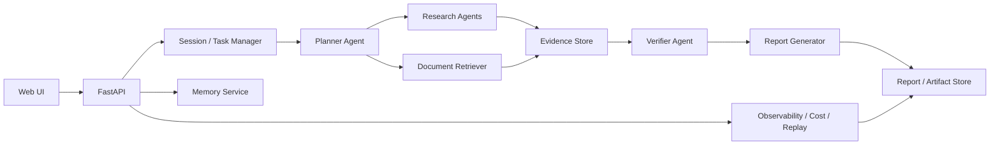

# Architecture

## Goal

Build a multi-agent research system that can plan, search, retrieve, remember, verify, and report.

## System Flow

## Core Modules

### Planner Agent

- Normalizes the user request.
- Breaks it into sub-questions.
- Decides whether clarification is needed.

### Research Agents

- Run web search in parallel.
- Summarize evidence with citations.
- Return structured findings instead of raw text only.

### Retriever

- Indexes uploaded PDFs, notes, and prior project artifacts.
- Supports semantic retrieval and source attribution.

### Memory Service

- Stores user preferences.
- Stores canonical facts and prior conclusions.
- Supports short-term context and long-term memory.

### Verifier Agent

- Checks citation completeness.
- Detects contradictions or missing evidence.
- Flags weak claims before final report generation.

### Report Generator

- Writes the final answer or report.
- Keeps source references attached to each section.

### Observability Layer

- Tracks token usage and tool calls.
- Stores traces, failures, and replay inputs.
- Helps explain why a run succeeded or failed.

## Data Model

- `research_session`
- `research_task`
- `evidence_item`
- `memory_item`
- `report_version`
- `run_ledger`

## Inspiration Split

- `open_deep_research`: planning, parallel research, citations, report generation
- `PraisonAI`: memory, handoff, observability, evaluation, workflow patterns

## MVP Sequence

1. Search-only report generation.
2. Add private document retrieval.
3. Add memory and user preferences.
4. Add verification and replay.
5. Add evaluation and scoring.

