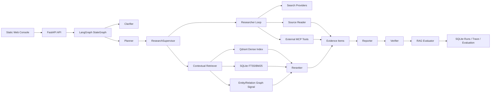

# Architecture

## Goal

AI Research Copilot is implemented as a single-node **Agentic Research Runtime**. It plans an open-ended technical question, gathers evidence through web search, GitHub MCP, and local contextual retrieval, then produces a citation-backed report with trace and evaluation artifacts.

The repo should be treated as an AI engineering experiment and interview project, not as a claim that a small student-built assistant can outperform Codex or Deep Research. The useful learning target is the runtime mechanism: stateful planning, structured tool calls, bounded researcher loops, evidence contracts, Agentic RAG, verification, evaluation, and replay.

The runtime is aimed at open-source project research, engineering decision research, and local technical-corpus grounding. It is not a private-data assistant, a GitHub-only analyzer, or an MCP wrapper around another deep-research system.

The current runtime path is:

```text
clarify -> plan -> supervise -> search/read/retrieve -> synthesize -> verify/evaluate -> replay
```

The core does not include a project memory service. That module was removed because the current experimental assets are stronger around research orchestration and Agentic RAG than around long-term personalization.

## System Flow



## Runtime Nodes

The LangGraph runtime has one active orchestration path:

```text
supervisor_start
-> planner
-> research_supervisor
-> parallel_research
-> reporter
-> verifier_evaluator
-> revision_prepare or finalize
```

`revision_prepare` loops back to `planner` when verification or evaluation detects quality gaps and revision budget remains.

## Core Design Choices

- `LangGraph` is used because the workflow has explicit state, branches, retries, revision loops, checkpoints, and finalization.
- `FastAPI` is used as a thin local API, not as a business CRUD backend.
- `Qdrant` handles dense retrieval for uploaded/project documents.
- `SQLite FTS5/BM25` provides exact lexical recall and keeps local demos reproducible.
- The graph signal is LightRAG-inspired but intentionally bounded: entity and relationship hits are fused into retrieval candidates before reranking; this is not a full GraphRAG platform.
- `Qwen/DashScope rerank` or another configured reranker orders fused retrieval candidates in real-provider mode.
- `Celery/Redis` is optional single-node API/worker separation. It should not be described as a distributed scheduling system.
- MCP is an optional external tool boundary. The removed local workbench MCP is not part of the current architecture.

## Evidence Channels

- External evidence: search provider results plus provider raw content read by `source_reader.py`.
- Internal evidence: uploaded documents parsed by `document_reader.py` and retrieved by `retrieval/store.py`.
- MCP evidence: results from a configured external MCP server and explicit tool allowlist. For GitHub MCP, the researcher passes structured arguments such as `owner`, `repo`, `path`, `issue_number`, or `query`.
- Run artifact evidence: synthetic evidence summarizing the run plan, routes, query rewrites, trace, and evaluation metadata.

All channels become `EvidenceItem` objects so the reporter, verifier, and evaluator can reason over one citation contract.

## MCP Boundary

Current MCP support is client-side only:

```text
Researcher -> mcp_tools.py -> configured external MCP server -> EvidenceItem(kind="mcp")
```

Recommended external MCPs:

- GitHub MCP remote read-only endpoint for technical research about repositories, implementation details, issues, pull requests, releases, and code-level evidence.
- Paper/search MCP only when the demo topic genuinely needs scholarly metadata outside the configured search provider.

Avoid full "deep research assistant" MCPs as the default. They duplicate this project's planner/supervisor/reporter and blur the architecture.

The model provider receives a compact MCP tool catalog. It chooses between `web_search` and `mcp_tool`; when it chooses MCP, it must set `mcp_tool_name` and `mcp_tool_args`. This keeps Tavily as the broad web channel, local RAG as the private/document channel, and GitHub MCP as a developer source-of-truth channel.

Future option: expose this project as its own MCP Server. That should be implemented as a separate outward-facing facade, for example:

- `run_research(topic, depth)`
- `search_local_corpus(query)`
- `inspect_research_run(run_id)`

That future server should call the stable FastAPI/application services. It should not reintroduce the deleted local workbench that existed mainly for demos.

## API Surface

- Research: `clarify`, `runs`, `jobs`, `status`, `result`, `trace`, `evaluation`, `replay`.
- Documents: add, ingest, search, delete, clear.
- Runtime: config and provider readiness.
- History: clear runs/jobs/telemetry.

There are no memory endpoints in the current API.

## Data Model

Important schema objects:

- `ResearchRequest`
- `PlanItem`
- `RetrievalRoute`
- `SupervisorToolCall`
- `ResearcherToolDecisionContract`
- `EvidenceItem`
- `ResearchNote`
- `ReportSection`
- `ResearchReport`
- `RAGEvaluation`
- `ResearchRun`

## Honest Boundaries

This project is credible as an interview-grade AI application because the research graph, retrieval stack, evaluation, and trace artifacts are real and test-covered. It is most convincing when presented as a learning-by-building implementation of research-agent runtime mechanics.

Do not overclaim:

- multi-tenant SaaS
- distributed durable execution
- browser automation
- OCR/layout intelligence
- enterprise personalization memory
- generic agent platform

The strongest claim is narrower and better: an inspectable single-node AI research runtime with ODR-style planning/supervision and a practical Agentic RAG evidence layer.
