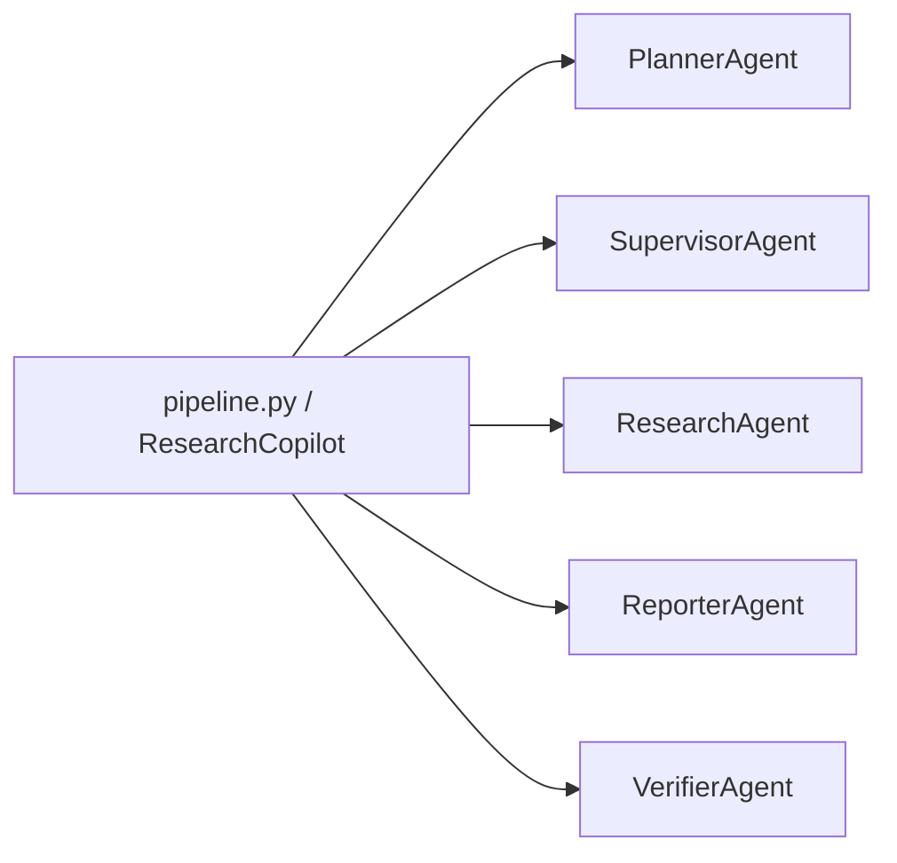

# agents/ 代码阅读指南

对应源码：
```text
D:\kn\projects\agentic-research-copilot\src\agentic_research_copilot\agents
```

一句话定位：
> `agents/` 不是一组彼此独立的“智能体程序”，而是一组面向角色的薄封装。它把 planner、supervisor、researcher、reporter、verifier 这五个职责拆开，方便 `pipeline.py` 和 `graph_runtime.py` 按阶段调用。

如果你先记住一个总图，就记这个：



## 1. 先看目录职责

`agents/` 目录的文件很少，但每个文件都很明确：

| 文件 | 作用 | 你要重点看什么 |
| --- | --- | --- |
| `__init__.py` | 统一对外导出 | 包的公共入口 |
| `planner.py` | 生成研究 brief 和计划 | `draft()`、`last_usage` |
| `supervisor.py` | 规范化监督者决策 | `decide()`、`_normalize()` |
| `researcher.py` | 收集证据、迭代检索 | `collect_iterative()`、`SourceReader` |
| `reporter.py` | 把证据拼成报告 | `build_report()`、证据去重 |
| `verifier.py` | 检查报告质量 | `assess()`、`verify()` |

这层目录的设计思路很简单：

1. `graph_runtime.py` 负责流程。
2. `agents/` 负责角色行为。
3. `providers.py` 负责真正的模型调用和结构化输出。

所以你读 `agents/` 时，不要把它理解成“算法都写在这里”。更准确地说，它是 **把模型能力包装成可调用的角色接口**。

这一点很容易误会：

> 你如果只看 `agents/`，会觉得里面没有多少“大模型逻辑”。这是正常的。真正的 prompt、结构化 JSON schema 调用、OpenAI-compatible HTTP 请求和 embedding 调用都在 `providers.py`。为了让主链路更好读，deterministic test double 已经拆到 `deterministic_provider.py`，`providers.py` 现在更聚焦真实模型适配。

继续学习时建议接着看：

```text
docs\learning\zh\ai_research_copilot_providers_py_guide_zh.md
```

## 2. `__init__.py`：公共入口

`__init__.py` 只做 re-export：

- `PlannerAgent`
- `ResearchAgent`
- `VerifierAgent`
- `ReporterAgent`
- `SupervisorAgent`

它本身没有业务逻辑，作用就是让外部可以这样导入：

```python
from agentic_research_copilot.agents import PlannerAgent, ResearchAgent
```

这说明 `agents/` 是对外稳定边界，不是随便散落的实现细节。

## 3. `PlannerAgent`：把请求变成研究计划

文件：
```text
src\agentic_research_copilot\agents\planner.py
```

核心类：`PlannerAgent`

这个类非常薄，基本就是一个模型调用适配器。

### 它做什么

- `draft()`：调用 `model_provider.draft_plan(...)`，拿到 `PlannerContract`
- `create_research_brief()`：只取 brief
- `create_plan()`：只取 plan
- `last_usage`：记录最近一次模型调用的 token、延迟等信息

### 你要注意的点

1. 它不自己发明计划算法。
2. 它负责把 `ResearchRequest`、`CorpusProfile`、`memory_records`、`revision_notes` 这些输入交给 provider。
3. 它把 provider 的输出交还给上层工作流。

也就是说，`PlannerAgent` 的职责是“把问题写成可以执行的计划”，不是“凭空解决问题”。

## 4. `SupervisorAgent`：把监督者输出变成可执行决策

文件：
```text
src\agentic_research_copilot\agents\supervisor.py
```

核心类：`SupervisorAgent`

这是 `agents/` 里最像“控制塔”的角色。它收到的是计划、路由、记忆和语料概况，然后产出一份监督者决策。

### 它做什么

- `decide()`：调用 `model_provider.supervise_research(...)`
- `_normalize()`：把 LLM 输出整理成可执行的 tool calls
- `_normalize_conduct_call()`：规范 `ConductResearch` 这类调用
- `_fallback_route_fields()`：当模型输出不完整时补默认值
- `_valid_tools()`：过滤非法工具名
- `_clean_queries()`：清理重复和空查询

### 它最重要的设计

`SupervisorAgent` 不相信模型输出可以天然直接执行，所以它会做一层强校验：

1. 如果没有 `think_tool`，补一个。
2. 如果必需的计划项没被分配研究任务，补 `ConductResearch`。
3. 如果没有 `ResearchComplete`，补一个。
4. 如果没有私有文档可用，就移除 `vector_retrieval`。
5. 如果工具列表为空，就至少退回到 `web_search`。

这层逻辑很关键，因为它让整条链路更像“可落地系统”，而不是“模型输出什么就信什么”。

### 你可以怎么理解它

`SupervisorAgent` 的本质是：

> 把一个可能不稳定的监督者结构化输出，整理成一份能让后续节点真的跑起来的执行单。

## 5. `ResearchAgent`：真正的证据收集循环

文件：
```text
src\agentic_research_copilot\agents\researcher.py
```

核心类：
- `ResearchCollection`
- `ResearchAgent`

这个文件是 `agents/` 里最有“算法味道”的一个。它不是简单包了一层模型调用，而是把一次研究单元的收集过程做成了一个带边界的循环。

### `ResearchCollection`

这是一个结果容器，保存：

- `evidence`：最终证据
- `iterations`：每一轮做了什么
- `completed_reason`：为什么停下
- `follow_up_queries`：后续可继续追的查询

你可以把它理解成“研究任务的小型运行报告”。

### `ResearchAgent` 的输入

构造函数里它接了几类能力：

- `search_tool`：外部搜索
- `mcp_tool`：MCP 工具
- `model_provider`：决定下一步动作
- `embedding_provider`：给 `SourceReader` 做语义/上下文处理
- `source_reader_enabled`：是否启用原文读取
- `max_iterations`：最大循环轮次

这里有个容易误解的默认值：

> `ResearchAgent` 默认用的是 `DeterministicResearchModelProvider()`。

这个默认值主要用于直接单测或单独实例化 `ResearchAgent` 时保证对象能跑起来。真实主链路不是让 `ResearchAgent` 自己决定用哪个 provider，而是 `ResearchCopilot` 在 `pipeline.py` 里统一创建 `self.model_provider`，再注入给 `PlannerAgent`、`ResearchAgent`、`ReporterAgent`、`VerifierAgent` 和 `SupervisorAgent`。

所以要记住：

> `agents/` 只是角色调用入口，真实模型路径由 `settings.py -> build_model_provider(...) -> providers.py` 决定。严格真实 provider demo 下，应该通过 `ARC_STRICT_PROVIDERS=true` 和 `ARC_MODEL_PROVIDER=openai_compatible` 让系统启动时就拒绝本地 deterministic 配置。

### 它做什么

- `collect()`：走普通搜索，把结果转成 `EvidenceItem`
- `collect_mcp()`：走 MCP 工具，把结果转成 `EvidenceItem`
- `collect_iterative()`：做一个受限的 ODR 风格循环

### `collect()` 的关键点

如果搜索结果里带了 `raw_content`，它会交给 `SourceReader` 再处理一次：

- 提取更干净的 `content`
- 生成更短的 `snippet`
- 合并 metadata

这说明它不是只把搜索结果原样塞回去，而是会做一层内容净化。

### `collect_iterative()` 的核心逻辑

这个方法是研究员角色的主流程。它大致会：

1. 先准备查询队列。
2. 计算当前证据是否够用。
3. 让 `model_provider.decide_researcher_action(...)` 决定下一步。
4. 根据决策执行以下动作之一：
   - `ResearchComplete`
   - `think_tool`
   - `web_search`
   - `mcp_tool`
5. 把每轮结果记录进 `iterations`。
6. 根据 `min_evidence` 和 `min_sources` 判断是否结束。

### 它最值得记的几个 helper

- `_queued_or_follow_up_query()`：挑下一个查询
- `_sufficiency_gaps()`：判断证据缺口
- `_reflection()`：给这轮研究写一句自然语言反思
- `_build_follow_up_query()`：在证据不足时构造后续查询
- `_source_count()`：统计不同来源数量
- `_dedupe_evidence()`：证据去重
- `_unique()`：字符串去重

### 这个类的本质

`ResearchAgent` 不是“搜索工具本身”，而是“一个可反复研究、可停止、可回看”的小循环控制器。

这也是它和单次 `search -> answer` 脚本最不一样的地方。

## 6. `ReporterAgent`：把证据组织成可交付报告

文件：
```text
src\agentic_research_copilot\agents\reporter.py
```

核心类：`ReporterAgent`

这个类负责最后一步的“表达”。它不是再搜一次，而是把已有证据编排成报告。

注意：`ReporterAgent` 收到的 `sections` 已经是 `pipeline.py` 依据 `plan + notes + evidence` 生成的 topic 相关草稿。早期代码曾经生成固定系统介绍章节，这已经修掉了。现在 `ReporterAgent` 的职责是对这些 topic 相关章节做最终合成，并把 citation index 绑定回已有证据。

### 它做什么

- `compose()`：调用 `model_provider.compose_report(...)`
- `build_report()`：生成 `ResearchReport`
- `_build_synthesized_sections()`：把草稿章节和 citation 对齐
- `_source_names()`：提取来源名

### `build_report()` 的几个细节

它会做两层去重：

1. 去重 citation。
2. 去重 source。

然后它会把 `ReporterContract` 里的章节结构转成 `ResearchReport.sections`。如果模型返回的章节不完整，或者 citation index 对不上，它会回退到 `fallback_sections`。

这里的 `fallback_sections` 不是“本地假模型 fallback”，而是 `pipeline.py` 已经构造好的 topic 章节草稿。这个设计是为了避免最终报告因为模型输出格式小问题而直接丢掉可用证据。

这点很重要，因为它说明这个模块不是“无脑信模型”，而是尽量让报告结构保持可用。

### 你要记住的理解

`ReporterAgent` 的工作是：

> 把研究阶段收集到的证据，整理成带引用、带结构、带来源索引的最终回答。

## 7. `VerifierAgent`：检查报告能不能过关

文件：
```text
src\agentic_research_copilot\agents\verifier.py
```

核心类：`VerifierAgent`

这个类最短，但很关键。因为它决定报告能不能进入“结束”分支，还是要回去返工。

### 它做什么

- `assess()`：调用 `model_provider.assess_report(...)`，返回 `VerificationContract`
- `verify()`：只取 `issues`

### 它在系统里的角色

它不是重新生成报告，而是回答两个问题：

1. 报告有没有明显问题。
2. 如果有问题，问题是什么。

在 `graph_runtime.py` 里，`VerifierAgent` 的结果会直接影响是否进入 revision loop。

## 8. 这五个 Agent 是怎么连起来的

你可以把它们按主链路记成一条线：

```text
PlannerAgent
-> SupervisorAgent
-> ResearchAgent
-> ReporterAgent
-> VerifierAgent
```

更具体一点：

1. `PlannerAgent` 先把任务拆成研究计划。
2. `SupervisorAgent` 决定哪些 plan item 需要研究、用什么工具。
3. `ResearchAgent` 针对每个计划项收集证据。
4. `ReporterAgent` 用证据生成报告。
5. `VerifierAgent` 检查报告质量，决定是否返工。

这个顺序和 `graph_runtime.py` 的节点顺序是一致的。

## 9. 读这个目录时，最该盯住的设计点

### 1）它们都是“薄封装”

大多数 agent 并不自己实现复杂模型逻辑，而是：

- 持有 `model_provider`
- 调用 provider
- 记录 `last_usage`
- 做必要的规范化或后处理

所以你现在的阅读重点应该从 `agents/` 转到 `providers.py`：那里才有 `draft_plan`、`supervise_research`、`decide_researcher_action`、`compose_report`、`assess_report` 这些真模型方法。

### 2）它们在替模型结果兜底

尤其是 `SupervisorAgent` 和 `ReporterAgent`：

- 一个负责把工具调用规范化
- 一个负责把引用和章节结构整理成可交付物

### 3）`ResearchAgent` 是唯一明显带循环控制的角色

如果你只想先抓最核心的一块，就先看它。

### 4）这些类不是并行服务

它们不是分布式 worker，也不是后台 agent 进程。
它们更像是同一个工作流里的不同角色函数。

## 10. 推荐阅读顺序

如果你准备快速熟悉这部分代码，建议按这个顺序看：

1. `agents/__init__.py`
2. `planner.py`
3. `supervisor.py`
4. `researcher.py`
5. `reporter.py`
6. `verifier.py`

如果你时间更紧，直接先看：

1. `researcher.py`
2. `supervisor.py`
3. `reporter.py`
4. `providers.py`

因为这几块最能代表这个项目的核心链路。

## 11. 面试时怎么讲

你可以这样概括：

> `agents/` 目录把研究流水线拆成五个角色：planner 负责生成研究计划，supervisor 负责把模型的工具调用规范化，researcher 负责做有边界的证据收集循环，reporter 负责把证据组织成带引用的报告，verifier 负责决定结果是否可以结束或需要返工。它们本身大多是薄封装，真正的模型能力在 `providers.py`，这样做的好处是角色边界清楚、可测试、可替换，也方便接到 LangGraph 工作流里。

## 12. 读完后你应该能回答的问题

1. `PlannerAgent` 和 `SupervisorAgent` 的区别是什么。
2. 为什么 `SupervisorAgent` 要做 normalize。
3. `ResearchAgent.collect_iterative()` 为什么不是一次搜索就结束。
4. `ReporterAgent` 为什么还要去重 citation 和 source。
5. `VerifierAgent` 为什么只负责判断质量，不负责重写报告。

如果这些问题都能答出来，你就已经把 `agents/` 这层真正读懂了。
