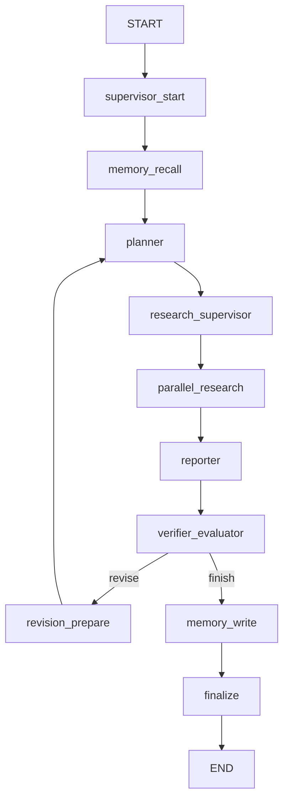

# graph_runtime.py 代码阅读指南

对应源码：
```text
D:\kn\projects\agentic-research-copilot\src\agentic_research_copilot\graph_runtime.py
```

一句话定位：
> `graph_runtime.py` 是这个项目真正的工作流执行器。`pipeline.py` 负责把模型、检索、记忆、报告和校验这些能力装配好；`graph_runtime.py` 负责把它们串成一张可检查点、可回放、可返工的 LangGraph。

如果你只记住一件事，就记住这个执行顺序：



## 1. 先把它放进全局架构

这三个文件的分工要先分清：

| 文件 | 作用 |
| --- | --- |
| `schemas.py` | 定义数据契约，决定各模块之间传什么 |
| `pipeline.py` | 装配能力，提供 planner、supervisor、retriever、reporter、verifier 等 helper |
| `graph_runtime.py` | 把 helper 组织成一条真正可运行的 LangGraph 工作流 |

所以 `graph_runtime.py` 不是“多写了一层壳”，它是项目的主调度层。它解决的是：

1. 任务如何从开始走到结束。
2. 什么时候返工，什么时候结束。
3. 中间状态如何保存和回放。
4. 运行轨迹如何记录，方便排错和面试解释。

## 2. 核心数据：`ResearchGraphState`

`ResearchGraphState` 是这张图的共享状态对象。它是 `TypedDict(total=False)`，意思是每个节点都可以只返回自己新增或更新的字段，不需要把全部状态重新组装一遍。

你可以把它理解成一只“运行中的背包”，里面大致分成几类东西：

| 类别 | 关键字段 | 含义 |
| --- | --- | --- |
| 运行标识 | `request`, `job_id`, `run_id`, `start` | 这次任务是谁、何时开始 |
| 过程记录 | `checkpoints`, `trace`, `handoffs` | 发生了什么、谁传给谁、在哪个阶段 |
| 记忆与证据 | `memory_records`, `memory_hits`, `final_evidence`, `final_web_hits`, `final_document_hits` | 检索到什么、证据从哪里来 |
| 计划与执行 | `final_research_brief`, `final_plan`, `final_search_queries`, `final_retrieval_routes`, `final_notes` | 计划怎么写、怎么搜、怎么汇总 |
| 质量控制 | `final_report`, `final_evaluation`, `final_issues`, `needs_revision`, `revision_reason` | 报告质量和是否返工 |
| 结果收口 | `final_status`, `failure_reason`, `run` | 最终状态和最终产物 |

读这个文件时，先别被函数名吓到。你真正要追的是：**每个节点读了哪些字段，写回了哪些字段**。

## 3. 启动阶段：`__init__`、`_build_checkpointer`、`run`

位置大概在：
```text
graph_runtime.py:62-83
graph_runtime.py:91-114
```

这里做了三件事：

1. `__init__` 先建 checkpointer，再建 graph。
2. `run()` 为每次执行创建新的 `run_id`，并把它作为 LangGraph 的 `thread_id`。
3. `close()` 负责清理 sqlite context 和连接。

这几个点很关键：

- `run_id` 是这次执行的唯一身份。
- `thread_id=run_id` 让 checkpoint 和这次任务绑定在一起。
- `finally: self.close()` 保证无论成功还是失败，资源都会被释放。

`_build_checkpointer()` 的逻辑也很重要：

- `langgraph_checkpointer != "sqlite"` 时，直接用 `MemorySaver()`。
- 要是用 sqlite，就先把路径解析到绝对路径，再尝试加载 `SqliteSaver`。
- `strict_providers=True` 时，任何缺包或打开失败都直接报错，不偷偷 fallback。

这就是工业化感的一个点：**运行状态不是只靠内存记住，而是有明确的持久化策略**。

## 4. 图结构：`_build_graph`

位置大概在：
```text
graph_runtime.py:116-143
```

这段代码定义了整张图的骨架：

1. 先注册节点。
2. 再连线。
3. 再为 `verifier_evaluator` 配置条件分支。
4. 最后 `compile(checkpointer=...)`。

你可以把节点职责记成一句顺口溜：

> 起步、回忆、规划、监督、研究、写作、验证、返工、落盘、结束。

### 节点职责一览

| 节点 | 作用 |
| --- | --- |
| `supervisor_start` | 初始化运行状态，发出第一次 trace/checkpoint |
| `memory_recall` | 读取历史记忆并转成证据 |
| `planner` | 生成研究 brief 和研究计划 |
| `research_supervisor` | 决定每个计划项怎么研究、用什么工具 |
| `parallel_research` | 批量执行研究并收拢证据 |
| `reporter` | 生成最终报告和来源索引 |
| `verifier_evaluator` | 验证报告质量，并评估 RAG 指标 |
| `revision_prepare` | 如果要返工，回到 planner 前先补状态 |
| `memory_write` | 把高质量结果写回 memory |
| `finalize` | 组装 `ResearchRun`，写 ledger 和 storage |

## 5. 节点逐个看

### `supervisor_start`

位置：
```text
graph_runtime.py:146-224
```

这一步是初始化器，不做研究本身，先把运行场景搭起来：

- 生成或确认 `run_id`。
- 记录开始时间。
- 发出 `run.start` 事件。
- 填好一大批默认状态字段。
- 写入 `langgraph.runtime` 和 `supervisor.start` checkpoint。

这里的默认值很有用。比如：

- `final_status` 先设成 `"completed"`，后面如果验证失败再改。
- `needs_revision` 先设成 `False`。
- 各种 `final_*` 字段先给空值或空列表，后面节点直接覆盖。

这样后续节点就不需要到处写防御性判断。

### `memory_recall`

位置：
```text
graph_runtime.py:226-240
```

这一步只干一件事：如果 `request.use_memory` 为真，就回忆历史记忆。

它会：

- 调 `self.copilot._recall_memory_context(...)`
- 把 memory records 转成 `memory_hits`
- 写 `memory.recalled` checkpoint

你要注意，memory 在这里不是“答案”，而是“额外证据”。它会进入后面的规划、报告和置信度估计。

### `planner`

位置：
```text
graph_runtime.py:242-306
```

这一步是研究计划生成器。

它会：

- 记录从 supervisor 到 planner 的 handoff。
- 调 `planner.draft(...)` 生成 `PlannerContract`。
- 拿到 `research_brief` 和 `plan`。
- 用 `router.build_routes(...)` 生成 route hints。
- 写 `plan.generated` checkpoint。

这一步的结果会变成后续所有节点的主输入：

- `final_research_brief`
- `final_plan`
- `final_route_hints`
- `final_corpus_profile`

也就是说，后面的研究不是重新想题，而是沿着这个计划往下做。

### `research_supervisor`

位置：
```text
graph_runtime.py:308-473
```

这一步是“监督者”角色，负责决定怎么分配研究单元、怎么选工具。

它会：

- 调 `supervisor_agent.decide(...)`
- 把监督者的 structured decision 转成 `retrieval_routes`
- 再用 `workflow.build_queries(...)` 生成 `search_queries`
- 记录 `think_tool`、`ResearchComplete`、`ConductResearch` 这几类 tool call trace

这里很容易误会成“真的在调用工具函数”。其实不是。这里记录的是 **agent 的决策**，不是 Python 里直接跑一个同名函数。

这个节点最重要的产物是：

- `final_supervisor_decision`
- `final_search_queries`
- `final_retrieval_routes`

### `parallel_research`

位置：
```text
graph_runtime.py:475-635
```

这一步是把多个 plan item 的研究结果收拢起来。

它会：

- 先 checkpoint `research.parallel.started`。
- 调 `self.copilot._research_plan_items(...)`。
- 按 plan item 收集 web evidence、document evidence 和 note。
- 记录 web 检索 trace 和文档检索 trace。
- 做 evidence 去重。
- 给每个 plan item 写自己的 checkpoint。
- 最后再拼一个运行级别的 `runtime_evidence`。

这里要记住一个概念：

> `parallel_research` 是一个“并行研究阶段”的节点名，但真正的并发/批量细节由 `pipeline.py` 的 helper 和 workflow 决定。

这个节点的输出是：

- `final_web_hits`
- `final_document_hits`
- `final_notes`
- `final_evidence`

它非常像“把散落的搜证过程，重新整理成可交付资产”。

### `reporter`

位置：
```text
graph_runtime.py:637-690
```

这一步负责把研究结果写成最终报告。

它会：

- 调 `_build_sections(...)` 组织章节。
- 调 `_estimate_confidence(...)` 估算置信度。
- 记录 handoff 到 reporter。
- 调 `_rank_evidence_for_report(...)` 排序证据。
- 调 `reporter.build_report(...)` 生成 `ResearchReport`。
- 再给 report 填 `source_index`。

这里要分清两个东西：

- `evidence` 是原始证据池。
- `report` 是面向用户的成品。

也就是说，这一步不是“再搜一遍”，而是“把已有证据编排成可读答案”。

### `verifier_evaluator`

位置：
```text
graph_runtime.py:692-826
```

这是整张图里最像“质量闸门”的节点。

它把两类检查分开做：

1. `verifier.assess(...)`：更偏报告本身的正确性、覆盖度、是否需要返工。
2. `evaluator.evaluate(...)`：更偏 RAG 质量指标，比如 retrieval hit rate、citation precision、source diversity。

然后它会：

- 写 `report.verified` checkpoint。
- 写 `rag.evaluated` checkpoint。
- 计算 `should_revise`。
- 计算 `final_status`、`failure_reason`、`needs_revision`。

这里非常关键的一点是：

> 验证和评估不是一回事。一个看报告是否能交，一个看检索与引用链路做得好不好。

这也是这个项目不像玩具的地方之一。它不是只给一个答案，而是明确检查“答案是怎么来的”。

### `revision_prepare`

位置：
```text
graph_runtime.py:828-848
```

这是返工的入口。

它会：

- `revision_count + 1`
- 记录从 supervisor 回到 planner 的 handoff
- 写 `supervisor.revision_requested` checkpoint
- 清掉 `needs_revision`

这一步是整张图里唯一明确的回边。没有它，图就只是直线流程；有了它，图才是“可循环迭代”的工作流。

### `memory_write`

位置：
```text
graph_runtime.py:850-875
```

这一步负责把最终结果写回 memory。

它只在两个条件同时满足时执行：

1. `request.use_memory` 为真。
2. `report` 已经生成。

然后它会：

- 调 `_build_memory_artifacts(...)`
- 逐条 `save_memory(record)`
- 为每条 memory 记录 trace

这里的设计很合理，因为它默认不会把半成品、失败稿或者未验证的结果写进记忆层。记忆层应该沉淀高质量内容，不是垃圾桶。

### `finalize`

位置：
```text
graph_runtime.py:877-924
```

这是收口阶段。

它会把这一整次运行整理成 `ResearchRun`，里面包括：

- 请求信息
- 计划与路由
- 证据与笔记
- 报告与评估
- checkpoints、trace、handoffs
- 最终状态和失败原因
- 开始/结束时间和耗时

然后它会：

- `ledger.record(run)`
- `storage.save_run(run)`
- 发送 `run.finish` telemetry

所以 `run()` 的最终返回值其实就是 `state["run"]`，也就是这个收口后的完整运行对象。

## 6. 三个最重要的辅助函数

### `_route_after_verification`

位置：
```text
graph_runtime.py:926-927
```

它只做一个选择：

- `needs_revision=True` 就走 `revise`
- 否则走 `finish`

这就是 `add_conditional_edges(...)` 用到的路由函数。

### `_checkpoint`

位置：
```text
graph_runtime.py:929-942
```

这是统一的 checkpoint 记录器。

它同时做三件事：

1. 把 `RunCheckpoint` 追加到 state。
2. 发 `checkpoint.created` telemetry。
3. 再补一条 trace event。

所以 checkpoint 不是单纯“存一下中间状态”，而是“机器可回放 + 人可追踪”的双重记录。

### `_append_trace` 和 `_record_handoff`

位置：
```text
graph_runtime.py:944-1002
graph_runtime.py:1004-1034
```

这两个 helper 是可观测性的底座：

- `_append_trace` 统一封装 trace event 和 telemetry。
- `_record_handoff` 统一记录 agent 之间的交接。

如果你以后要排查“哪一步丢了证据”“为什么返工”“哪个 agent 接了哪个任务”，先看这两类记录。

## 7. `_resolve_checkpoint_path`

位置：
```text
graph_runtime.py:1036-1041
```

这个函数很简单，但很实用：

- 如果路径不是绝对路径，就拼到当前工作目录下。
- 自动创建父目录。

这类小函数不花哨，但能让 sqlite checkpoint 的落盘位置可预期、可部署。

## 8. 怎么读这个文件，才不会绕

建议顺序是：

1. 先看 `ResearchGraphState`。
2. 再看 `__init__` 和 `_build_checkpointer`。
3. 再看 `_build_graph`，把整张图画出来。
4. 然后按顺序看每个节点。
5. 最后回头看 `_checkpoint`、`_append_trace`、`_record_handoff`。

如果你是第一次读这份代码，最好先问自己三个问题：

1. 这个节点的输入是什么。
2. 这个节点的输出是什么。
3. 这个节点是在“做事”，还是在“记录事”。

只要这三个问题答清楚，图就不会乱。

## 9. 面试时怎么讲

你可以把它概括成这样：

> 我们把研究任务做成了一张 LangGraph 状态图：先回忆 memory，再生成计划，再由监督者拆分研究单元，随后批量研究、汇总报告、做 verification 和 RAG evaluation，最后决定是否返工并把高质量结果写回 memory。整个过程有 checkpoint、trace、handoff 和持久化 run 记录，所以它不是一次性的脚本，而是一套可观测、可回放、可迭代的 agent runtime。

如果面试官继续追问，你就补这三点：

1. `pipeline.py` 负责能力装配，`graph_runtime.py` 负责工作流执行。
2. verification 和 evaluation 分开，避免只看最终答案不看链路质量。
3. checkpoint 和 memory write 都是显式设计，方便调试和沉淀高质量结果。

## 10. 容易误解的地方

1. `graph_runtime.py` 不是 prompt 集中地，prompt 和 agent 能力主要在 `pipeline.py`。
2. `parallel_research` 的名字表示阶段，不代表你一定能从这一个文件里直接看到所有并发实现。
3. checkpoint 不等于 trace，前者更偏状态快照，后者更偏事件日志。
4. `memory_write` 在验证之后才发生，不是运行一开始就写。
5. 失败的 run 也会被记录下来，所以不是“没成功就什么都没留下”。

## 11. 读完后你应该能回答的问题

1. 这张图的主链路是什么。
2. 为什么要有 `revision_prepare` 这个回边。
3. 为什么 `verifier` 和 `evaluator` 要分开。
4. 为什么 `run_id` 要当作 `thread_id`。
5. 为什么 memory write 放在最后。
6. `ResearchRun` 是在哪一步组装出来的。

如果这六个问题都能说清楚，你就已经把 `graph_runtime.py` 读进脑子里了，而不是只看过一遍代码。
