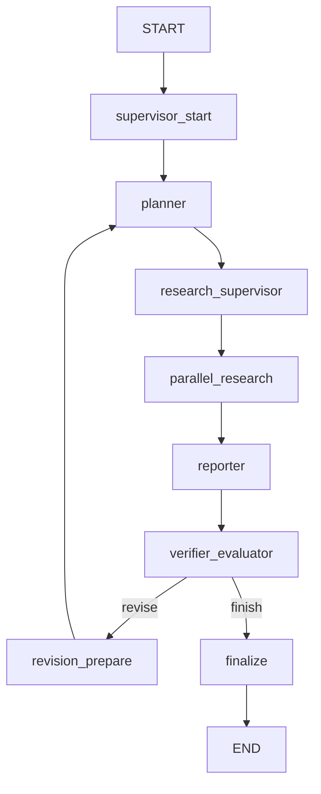

# `graph_runtime.py` 阅读指南

## 这个文件负责什么

`graph_runtime.py` 负责把一次研究任务跑成 LangGraph 状态图。它不负责具体检索算法，也不直接写复杂 prompt，而是控制节点顺序、状态传递、trace、checkpoint 和最终保存。

## 图结构

## State 是什么

`ResearchGraphState` 是整张图共享的状态字典。你可以把它理解成一次 run 的工作台。

重要字段：

- `request`：用户请求。
- `run_id`：本次运行 ID。
- `final_plan`：计划。
- `final_retrieval_routes`：检索路线。
- `final_notes`：各研究单元压缩后的发现。
- `final_evidence`：证据。
- `final_report`：报告。
- `final_evaluation`：评估。
- `trace`：运行轨迹。
- `checkpoints`：节点快照。

## 节点解释

### `supervisor_start`

初始化 run：

- 生成 run_id。
- 初始化 trace/checkpoints/handoffs。
- 写 `run.start` telemetry。

### `planner`

调用 `self.copilot.planner.draft(...)`。

输出：

- research brief
- plan items
- route hints

### `research_supervisor`

调用 supervisor agent，让模型输出：

- `think_tool`
- `ConductResearch`
- `ResearchComplete`

然后 `pipeline.py` 把这些 tool call materialize 成真正能执行的 `RetrievalRoute`。

### `parallel_research`

并发执行 plan items。

每个 item 会走：

- web search
- optional MCP tool，现在会在 trace 里记录 `mcp_tool_name`、`mcp_tool_args`、结果数和耗时
- optional document retrieval
- source reading/compression
- note compression

### `reporter`

把 plan、notes、evidence 组装成 `ReportSection`，再调用 reporter agent 生成最终报告。

### `verifier_evaluator`

做两类检查：

- `VerifierAgent`：模型或 deterministic provider 检查报告问题。
- `RAGEvaluator`：本地指标检查证据和引用质量。

如果质量不够且还有 revision budget，就走 `revision_prepare`。

### `revision_prepare`

记录返工原因，把 revision count 加一，然后回到 `planner`。

### `finalize`

生成 `ResearchRun`，保存到 ledger 和 SQLite。

## 你要重点理解的点

1. 这个文件表达的是“运行状态机”。
2. 真正的大模型调用在 provider。
3. 真正的检索在 `retrieval/store.py`。
4. trace 和 checkpoint 是项目工业化感的重要来源。
5. 当前图里没有 memory 节点。
